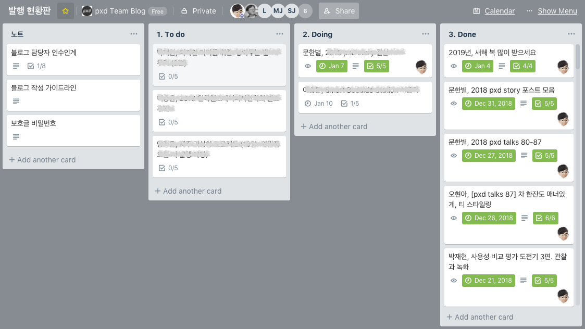
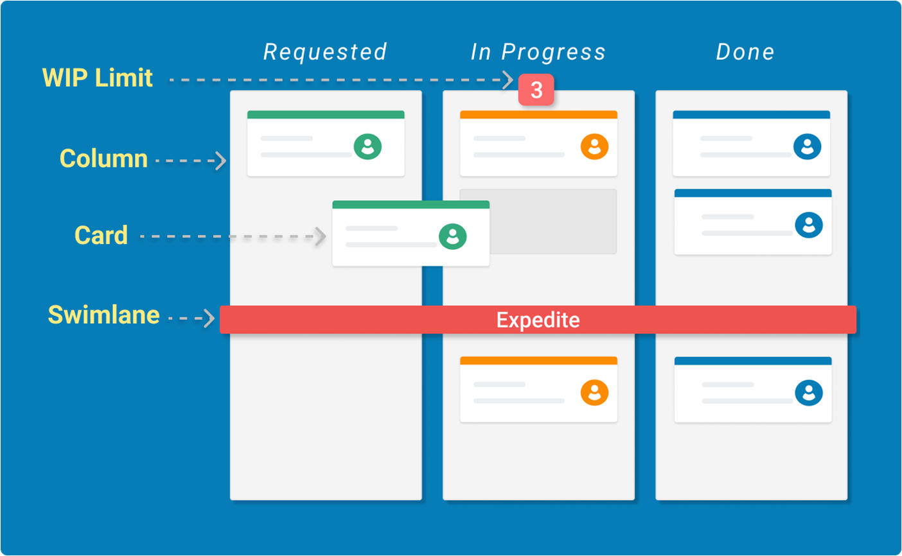

# kanban-methodology

##### 작성일 : 2020-01-09
##### 작성자 : phpbae

---

##칸반에 대한 이야기

1. Kanban ?
```
2010년 8월 데이비드 J. 앤더슨David J.Anderson)은 도요타 생산 방식의 서브 시스템인 칸반 생산 방식과
제약 이론 (TOC:Theory of constraints)의 당김 방식 Pulling system 을 착안해 
[칸반지속적 개선을 추구하는 소프트웨어 개발 Successful evolutionary change for your technology business]
이라는 서적을 출판하면서 알려지게 됩니다

칸반 = 일본어로 간판이라는 의미
각 과정(프로세스)마다 처리해야할 업무 또는 일, 사안을 전 과정 또는 다음 과정의 연속적인 흐름을 유기적 / 시각적
으로 표시하고 만들어 전체 과정 또는 흐름을 유연하게 만들고자 하는 방법론. 

글로는 설명이 어려울거 같으니, 예시 사진 첨부합니다.

```

- 트렐로(Trello)는 칸반을 활용하는 대표적인 협업도구 및 프로젝트 관리 도구 입니다.


---

2. Kanban 구조
```
칸반에 대한 구조를 설명하겠다.
```

- 칸반 구조


```
칸반 카드(Card) – 단일 작업요소의 시각적 표현입니다.(과정에 포함된 업무 또는 사안)
카드에는 담당자, 업무 및 일수 등을 표시하여 좀 더 구체적으로 표현이 가능합니다. 

칸반 열(Column) – 각 열은 work flow의 다른 단계를 나타냅니다. 카드는 완전히 완료 될 때까지 워크 플로우를 거칩니다.

진행중인 작업 제한(WIP Limit) – WIP(Work In Process) 워크 플로의 여러 단계에서 최대 작업 수를 제한합니다. 
아무리 합이 좋거나 개개인이 능력이 뛰어난 팀이라도 작업량은 한계가 있으므로 
WIP를 제한하면 팀이 현재 작업에만 집중할 수 있도록 하여 작업 항목을 더 빨리 완료 할 수 있습니다.
(이걸 좀 더 쉽게 설명하면, 특정열에서 처리가능한 카드수를 제한하는겁니다.)

스윔레인(Swimlane) – 여러 종류의 활동, 팀, 서비스 등을 구분하여 책임을 분리하는 데 사용할 수 있는 수평 레인입니다.
가령 마케팅 팀이나 운영팀과 칸반보드 프로세스를 공유할 경우 유용할 것으로 생각이 듭니다.


위 사진처럼
requested, in progress, done 로 표시된 부분이 각 열에 해당합니다.
각열 밑에 표시된 숫자 사진에서는 in progress 밑에 3이라고 표시된 숫자가 WIP를 의미합니다.
각 과정들은 왼쪽 -> 오른쪽으로 연속적으로 진행하게 됩니다.

해당 칸반 보드를 통해 한 프로젝트에서 관리되는 모든 이슈를 한 번에 확인할 수 있으며 WIP을 통해 
프로세스에 병목현상이나 지나친 업무 쏠림을 방지할 수 있습니다.

피드백 반복을 위해, 보류 또는 테스트 컬럼을 두기도 합니다.
테스트가 실패하면, 오른쪽으로 진행이 아닌 이전단계로 돌리고 다시 테스트해서 성공이면 done 으로.

```


### 정리하며..

```
저도 처음에 트렐로 사용하면서, 칸반에 대해 불편한 감정을 가지고 시작을 했습니다.
그런데, 이게 사용하면 할 수록 칸반에 불편한 감정이 사라지기 시작을 했습니다.
저의 이유는 팀원들이 무슨일을 하고 있는지 시각적으로 확인이 가능했다는 점과
카드가 차곡차곡 쌓이면 이걸 보고, 우선적으로 어떤업무를 해야할까 순위를 정하는게 좀 더 수월했기 때문인거 같습니다.

어쨋든 칸반에 대해서 정리를 하자면,
프로젝트에 참여한 모든 멤버가 알 수 있도록(업무흐름, 예측, 담당자 등) 시각화하는 것이 가장 큰 목표입니다

혹시나 도입을 하고자하는 분들이 계시다면 두려워하지마시길 바랍니다.
- 팀원들과 칸반에 대한 방법론 이해 부족
- 왜 사용해야하는지에 대한 이해 부족
- 새로운 툴을 사용하는 부담
등등 이러한 이유들로 실패를 이미 맛보신 분들도 계실겁니다.
그래도 계속해서 시도하고 한번 부딪쳐보시길 바랍니다.

```

#### Thanks
- 칸반에 관련해서 여러 이야기 해준 갓치킨에게 감사를..<br>
https://github.com/GodChiken

